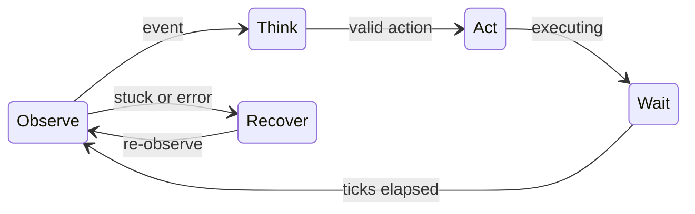
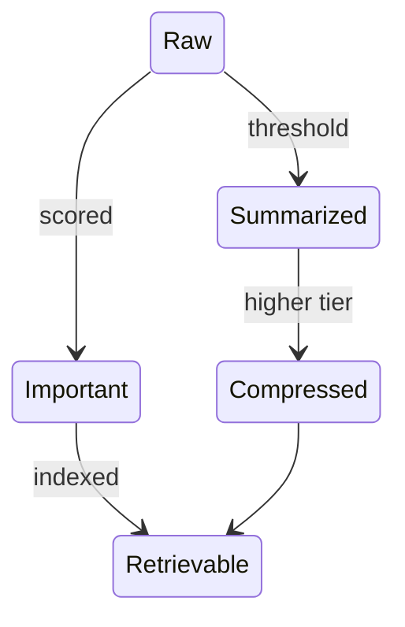
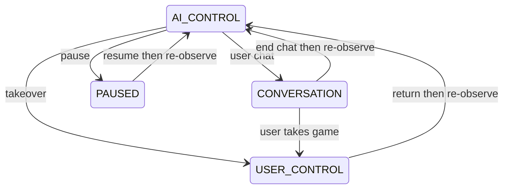

# Architecture

## Product north star

Memnara is a local, multi-runtime AI gaming companion framework capable of observing, reasoning about, controlling, remembering, and commenting on games across emulator-backed and native PC game runtimes.

The AI core must not assume `game == ROM`, `game == Game Boy`, `game == emulator`, or that RAM is always available. It consumes **advertised runtime capabilities** and the perception/input/state providers those capabilities enable.

A locally supplied Game Boy title + PyBoy is the first emulator-backed validation testbed. Enhanced structured-state maps are private. See [ADR-007](docs/adr/ADR-007-multi-runtime.md).

## Current implementation vs long-term scope

```text
CURRENT IMPLEMENTATION

PyBoy
optional local GameAdapter (private)
M3 local VLM vision
M4 source-aware perception fusion
M5 bounded autonomous control loop
M6 generic battle interaction mode
```

```text
FUTURE PRODUCT SCOPE

multiple emulator platforms
native PC runtime
capability-advertised providers
generic vision + input play
optional game-specific integration
cross-runtime profile continuity
```

SNES, PlayStation 1, DuckStation, GBA backends, and native Windows gameplay **do not exist** in application code. Do not document them as shipped features.

Application implementation: M1 harness, M2 optional local structured-state reader, M3 vision, M4 perception fusion, M5 bounded autonomy, M6 generic battle handling. M0–M6 are **COMPLETE / APPROVED**. The first post-M6 validation patch is **COMPLETE / APPROVED**. The second post-M6 movement patch is **COMPLETE / APPROVED**. Neither is a new milestone. M7 is not authorized.

## Runtime families (design)

### Emulator runtime

Generic execution behind a future `GameRuntime` (today: `EmulatorAdapter` + PyBoy). Examples of **future** backends: SNES emulator, DuckStation or equivalent for PS1, GBA. Capabilities vary by backend: framebuffer, controller, RAM, save states, pause, frame stepping, metadata. Do not assume every emulator exposes RAM or save states.

### Native PC runtime

**Future.** Ordinary installed Windows games (native title not fixed). Typical: window/screen capture, keyboard, mouse, optional controller, window/process metadata. Typical gap: no semantic game RAM. Memnara must still run on VISION + INPUT.

### Runtime vs game

```text
Runtime Backend     generic execution environment
Game Integration    optional game-specific knowledge
```

Adding a game must not rewrite the backend. Adding a backend must not rewrite the reasoning core. Example (future): `DuckStationRuntime` serving an enhanced locally installed title or a generic PS1 title.

## Capability model (design)

A runtime advertises capabilities rather than the core inferring them from type. Initial names (refinable).

**INPUT** is the umbrella “this runtime can inject validated player control.” **KEYBOARD**, **MOUSE**, and **CONTROLLER** are modality primitives under that umbrella. A runtime that advertises CONTROLLER (or KEYBOARD+MOUSE) thereby has INPUT. The core should consume advertised primitives, not guess from family name.

**VISION** (runtime) means a capture/framebuffer exists. `VisionProvider` is the VLM interpretation of that capture. They are not the same layer: capture can exist while the model is down.

Approximate mapping (refinable before M18):

| Capability | Likely provider | Perception / control |
|---|---|---|
| VISION | CaptureProvider | VisualObservation |
| INPUT / KEYBOARD / MOUSE / CONTROLLER | InputProvider | ActionRegistry primitives |
| RAM_STATE | StateProvider | PerceptionContext.game_state (optional) |
| WINDOW_STATE | GameRuntime / OS metadata | PerceptionContext.window_state (optional) |
| GAME_METADATA | GameRuntime | identity/title, not a perception source yet |
| SAVE_STATES / PAUSE / FRAME_STEPPING | SaveStateProvider / GameRuntime | control plane, not perception |

**PAUSE** (capability) = the engine can pause. **PAUSED** (ownership) = Memnara is not issuing play actions. Ownership `PAUSED` must work even if the runtime cannot pause the engine (stop issuing actions; do not require `PAUSE`). Queue policy for `PAUSED` is the same family as takeover: do not execute stale AI actions (cancel or freeze; exact policy at the control-ownership milestone).

Minimum generic gameplay path (future): **VISION + INPUT**. RAM adapters are enhancements.

Generic allowlisted primitives (`press_button` today; future `key_press` / `mouse_click` / …) are registered by `ActionRegistry` / `InputProvider` from advertised capabilities. A `GameAdapter` is **optional** and only adds title-specific high-level actions. GENERIC play must not require a GameAdapter.

Illustrative (only the PyBoy row describes **built** capabilities):

```text
Local GB title / PyBoy  VISION yes  CONTROLLER (hence INPUT) yes  RAM_STATE optional (private)  SAVE_STATES yes  FRAME_STEPPING yes
Native PC title         VISION yes  KEYBOARD yes  MOUSE yes  RAM_STATE no  SAVE_STATES no   (not implemented)
Unknown SNES game       VISION yes  CONTROLLER yes  RAM_STATE no initially  SAVE_STATES emulator-dependent  (not implemented)
```

## Support spectrum (labels may change)

```text
GENERIC     Vision + generic input
ENHANCED    Game-specific controls / visual hints
INTEGRATED  Vision + structured game state / RAM
FULL        Deeply validated game-specific integration
```

Incremental, not binary.

## Future abstractions (do not implement now)

Exact split requires architecture review before a migration milestone:

```text
GameRuntime
CaptureProvider
InputProvider
StateProvider
SaveStateProvider
RuntimeCapabilities
```

Keep current `EmulatorAdapter` until that milestone is authorized. Do not rename working M1–M3 code speculatively.

## Components (reference implementation shape)

Milestone 0 design, now partially realized in M1–M3. Interfaces remain conceptual except where M1–M3 implemented them.

```text
UI (PySide6)                    future
  → ControlOwnership            future (requirement stands)
  → AgentLoop (event-driven)    future
       → AgentLoop               M5 (bounded; see docs/milestones/m5-basic-autonomy.md)
       → PerceptionFusion       M4 (deterministic; see docs/milestones/m4-perception-fusion.md)
       → ModelProvider          first impl: local Ollama HTTP
       → ActionRegistry
            → GameAdapter       optional; local/private (M2)
            → EmulatorAdapter   PyBoy exists (M1)
       → MemoryStore            future
       → VoiceProvider          future
       → VisionProvider         M3 (universal capability)
```

Core must not import PyBoy or title-specific address tables. Title-specific addresses and PyBoy types stay out of the agent core.

Future-state sketch (not implemented; do not refactor M1–M3 to match it yet):

```text
Memnara Core
  → RuntimeCapabilities (advertised)
  → GameRuntime
       ├── CaptureProvider
       ├── InputProvider
       ├── StateProvider        optional
       └── SaveStateProvider    optional
  → GameAdapter                 optional title knowledge
  → VisionProvider              interprets captured frames
  → ActionRegistry              allowlisted primitives + optional game actions
```

`GameRuntime` is a sibling of `GameAdapter`, not a child of `ActionRegistry`.

## Interfaces (conceptual)

- `EmulatorAdapter` (current): load ROM path, `step_frames`, `capture_frame()`, press/hold/release, `read_bytes`, save/load_state, speed, `native_resolution` — PyBoy mapping stays in the adapter
- Future: `GameRuntime` wrapping emulator **or** native capture/input; `CaptureProvider`; `InputProvider`; optional `StateProvider` / `SaveStateProvider`
- `GameAdapter`: get_state (fair-RAM **when present**), detect_mode, list_actions, describe_state — optional per game
- `ModelProvider`: text/vision complete, schema, timeout, cancel
- `MemoryStore`: write/retrieve/summarize by scope; profile-keyed `ai_profile_id`
- `VoiceProvider`: speak(text, voice_id), cancel
- `VisionProvider` / `PerceptionProvider`: visual observation (`source=VISUAL`); RAM never unlabeled-merged
- `ActionRegistry`: allowlist, validate, reject unknown (never host shell)

## Vision

M3 vision is a **universal** Memnara capability. Capture the runtime’s native image (GB typically 160×144; do not bake that size into core). Integer-scale for UI/VLM; do not interpolate as “truth.” Event-triggered, plus screenshot-diff. VLM describes scene/menus/dialogue/battles. OCR: **VLM-first**. Vision never merged unlabeled with RAM.

Native PC (future): window/screen capture feeds the same `VisualObservation` path.

## RAM / state

Optional. `GameAdapter` maps verified addresses for a **pinned ROM hash** when RAM exists. Core consumes **opaque, source-labeled** fields. Fair-RAM policy: player-available vs privileged. Version verification: refuse adapter if hash mismatch. Generic unknown games and native PC titles may have **no** RAM_STATE. Title-specific maps are not in the public repository.

## Perception fusion (M4)

```text
VisualObservation (optional)
StructuredGameState (optional)
WindowState (optional slot; unused in M4)
        ↓
deterministic fuse()
        ↓
PerceptionContext (conflicts conserved; sources labeled)
```

RAM absence is normal. Generic fusion lives in `memnara.perception.fusion` and does not import PyBoy or title-specific addresses. A local GameAdapter may map a snapshot to `StructuredGameState` (including adapter-chosen `facts`). Generic `compact_summary` renders those facts without inspecting payload attribute names. Conservative battle conflict only; `battle_visible` is compared independently of `scene_type`. See [docs/milestones/m4-perception-fusion.md](docs/milestones/m4-perception-fusion.md).

Examples: emulator VISUAL + optional RAM; future native VISUAL + WINDOW_STATE; unknown emulator game VISUAL only.

## Fusion example (generic)

```text
VISUAL (interpretation): grass and a brown path; no NPCs visible.
RAM (verified): Game=local_id hash=… MapId=… X=… Y=… Party[0] HP=22/32
GOAL: find northern exit
MEMORY: last run looped at south gate
AFFECT: curiosity 0.6, frustration 0.2
CONFLICT: if RAM map is forest but vision says cave → flag discrepancy; do not drop either field.
```

Keep context small enough for local 8B (retrieve K memories, not the DB). M4 fusion itself does not attach goals, memory, or affect; those remain later milestones. M4 does not treat a VLM room description vs VERIFIED `map_id` as a conflict.

## Actions

**Current (M5–M6 emulator demo):** allowlisted `MOVE_UP` / `MOVE_DOWN` / `MOVE_LEFT` / `MOVE_RIGHT` / `PRESS_A` / `PRESS_B` / `PRESS_START` / `PRESS_SELECT` / `WAIT`. The model proposes one `ActionProposal`; `ActionValidator` rejects unknown or malformed output (only `action`/`parameters`/`reason`/`confidence`; no model-owned metadata). `GameBoyActionExecutor` maps names onto `EmulatorAdapter.press_button` / `tick`. Stuck v1 uses a semantic progress fingerprint, not raw framebuffer digest, when a structured token exists. No RAM writes. No shell. M6 does not add battle-specific action names. `derive_battle_view` marks `BATTLE_ACTIVE` when visual `battle_visible` or optional `is_in_battle` is true. M4 conflicts stay labeled. Ownership is checked before that mode can allow an action. A cheap `confirm_execution` can drop a proposal if the mode changed; the visual-only default does not call the VLM again. A locomotion attempt also gets a `MovementOutcome` (`MOVED`, `BLOCKED`, `UNCERTAIN`, `NOT_APPLICABLE`) from those same before/after observations. A clear surrounding-scene shift is `MOVED`. An unchanged whole frame is `BLOCKED`. A stable border with a center-only change is `UNCERTAIN` and is not progress. Optional generic facts `position_token`, `navigation_token`, and `location_token` override pixels when both observations have one. The outcome is separate from `screen_changed` and from meaningful progress. Repeated `UNCERTAIN` results with no other progress feed the existing stuck detector. Recent outcomes stay in the bounded step history. It does not add a vision call, a map, or a second stuck machine.

**Future allowlisted families (not implemented):** `key_press` / `key_hold` / `key_release`, `mouse_move` / `mouse_click`, `controller_button` / `controller_stick`. High-level title-specific names are not registered in M5.

Queue cancelled on CONVERSATION / USER_CONTROL / PAUSED. After takeover or resume, **re-observe** before any queued act. M5 implements the ownership gate only; M13 owns takeover UX.

## Event-driven loop

Do not call the VLM every frame. Triggers: screen delta, map/coord change (when RAM exists), battle/menu/dialogue, goal progress, action done, stuck signal, user interrupt, occasional reflection timer.



## Identity and personality

Stored config (user-editable later), not hard-coded “Misty” unless the user chooses. Fields: name, style, trait sliders (curiosity, humor, competitiveness, patience, risk, empathy, verbosity). Prompt always: *I am the AI; I play the game; I control a character; I am not the character.*

Profiles are independent of runtime, game, emulator, model, and voice. Example: the same profile may play a Game Boy title, later a native PC title, later another emulator title, retaining identity and appropriately scoped memories. Changing runtime or model does not mint a new identity.

## Commentary / experience (future)

Not only optimal actions: play, observe, react, form preferences, remember, comment, talk with the user, across games, subject to memory scope/retrieval. Not implemented here.

## Simulated affect

Dimensions 0–1: excitement, frustration, confidence, nervousness, curiosity, satisfaction, disappointment, amusement. Event deltas, exponential decay toward baseline. Influences commentary more than illegal/unfair RAM use. Not biological emotion.

## Memory scopes and compression

**Keyed by** stable `ai_profile_id`. The model is a replaceable reasoning engine; it does not own memory. See [ADR-008](docs/adr/ADR-008-ai-memory-knowledge-architecture.md) (**ACCEPTED**; not implementation authority for M7+).

**Layers (product):** live/recent step history; short-term session/working memory; long-term profile memory. Game Knowledge Packs are **not** personal memory.

**Scopes (stored, ADR-004 direction):** working, session, run, game, series, genre, cross-game, personal.  
**Compression tiers (not extra scopes):** raw events → episode summary → session → run → game → cross-game. Personal is not folded into game summaries.  
**Tags** on items: `universal` is an alias of cross-game write path (one path only). Also `genre:RPG`, `series:<id>`, `game:<id>`, `run:id`.  
Retrieve with **hard filters** (scope, game, run, importance, recency) then FTS. Do not FTS the whole DB unfiltered. Title-specific mechanics never write as `universal`/`cross-game` unless explicitly promoted. Importance 0–5; ≥4 survive compression. Context budget: working + top-k (e.g. 8–16). Working memory is session-ephemeral unless marked important.

Future bounded reasoning context must keep CURRENT PERCEPTION, CURRENT GOAL, LIVE/RECENT CONTEXT, SHORT-TERM SESSION MEMORY, LONG-TERM PROFILE MEMORY, GAME KNOWLEDGE, and RECENT ACTION HISTORY provenance-labeled. Do not collapse them into an unlabeled blob.



## Conversation and takeover

Runtime-independent. Exactly one gameplay owner. Same identity/memory for chat and play. Works for PyBoy **and** (future) other emulators and native Windows games.

Takeover: cancel stale AI actions → `USER_CONTROL`. Handback: clear stale input → re-observe current game state → `AI_CONTROL`.



## Stuck escalation

NORMAL → SUSPECTED_STUCK → CHANGE_STRATEGY → EXPLORE → ASK_USER → MANUAL_TAKEOVER. Signals: coords frozen (when available), screen hash loop, menu toggle, failed action count, no goal progress.

## Configuration (schema only)

YAML/env (client-side): paths, `rom_path` / future window or process selectors, adapter id, voice id, commentary rate, capture retention, debug, secrets in `.env` (see `.env.example`).

Memnara connects to the local Ollama HTTP server at `http://127.0.0.1:11434`. Application configuration may contain:

- Ollama endpoint/host (loopback only; no cloud fallback);
- required model name;
- timeout/retry settings;
- model-generation options;
- other client-side inference settings.

Memnara does **not** set or depend on `OLLAMA_MODELS` as an application/runtime client setting. Ollama model storage is owned by the Ollama **server** process. Memnara should query the active server for required-model availability and fail clearly if the model is unavailable. Any future Memnara-owned Ollama server process requires a separate approved architecture decision.

## Future UI (not implemented)

**M10** (desktop PySide6 shell, ADR-006) should eventually select: Runtime Type, Platform, Runtime/Emulator, Game/ROM/Window, AI Profile, Model, Voice, Control Preset, plus input mapping. Display **detected capabilities**. Model list from local Ollama discovery, not a hard-coded menu. Examples: Emulator / platform / backend / window title. No UI in this documentation correction.

## Data model (logical)

`Identity`, `Personality`, `AffectState`, `Game`, `Run`, `Session`, `Observation`, `Event`, `MemoryItem`, `Summary`, `Goal`, `Preference`, `ModelCallMetric`, `UserIntervention`. SQLite; don’t over-normalize in v1.

## Errors

Ollama down → pause AI_CONTROL, log, keep memory. Timeout/malformed JSON → retry then wait/ask. Emulator/runtime crash → don’t corrupt DB; user relaunch. Disk < 15 GB → shed captures. Invalid action → reject.

## Observability

Rotating logs in `D:\Memnara-Data/logs`: decisions, actions, model latency, retrieval ids (not full dumps), stuck, interventions. No API keys. Bound screenshot archives.

## Concurrency and UI

See `docs/research/ui-concurrency-storage.md`.
